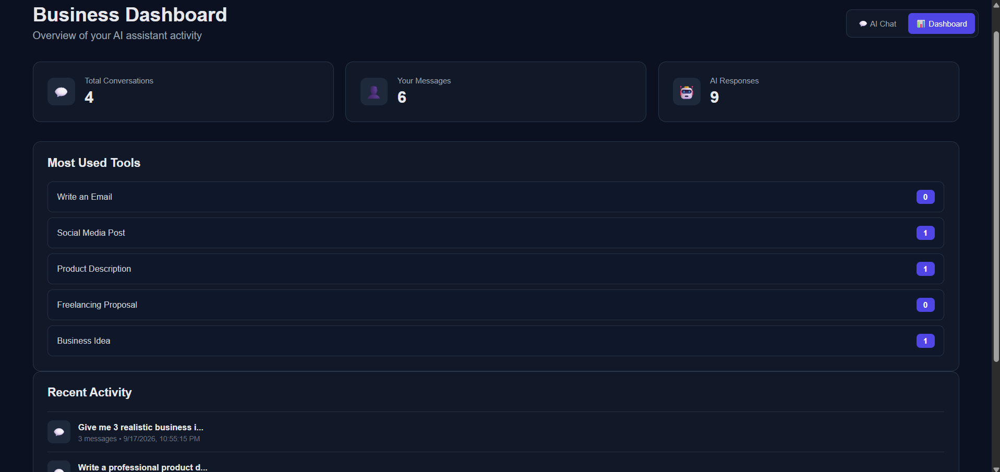
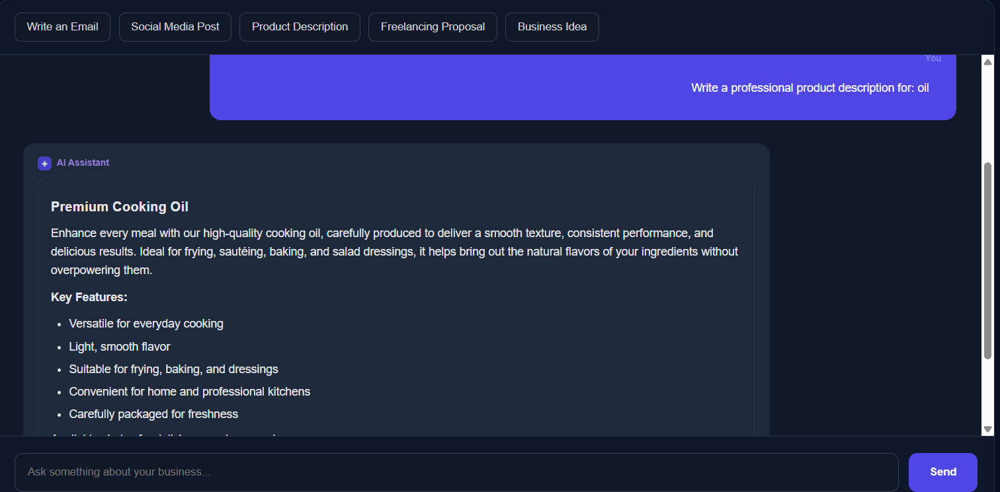
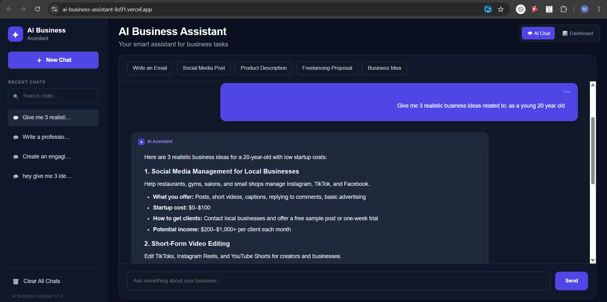

# 🤖 AI Business Assistant

A full-stack AI-powered business assistant that helps users generate business content, ideas, emails, social media posts, product descriptions, and freelancing proposals using OpenAI.

## 🚀 Live Demo

https://ai-business-assistant-ks91.vercel.app/

## 📸 Screenshots

<p align="center">
  
</p>

<p align="center">
  
</p>

<p align="center">
  
</p>

## ✨ Features

* 💬 AI-powered business chat
* 📧 Email generation
* 📱 Social media post generation
* 🛍️ Product description generation
* 💼 Freelancing proposal generation
* 💡 Business idea generation
* 🔄 Multiple conversations
* 💾 Conversation history using browser storage
* 📋 Copy AI responses
* 🔁 Regenerate responses
* ✂️ Make responses shorter
* 👔 Make responses more professional
* 🧠 Explain responses in simpler language
* 📱 Responsive interface

## 🛠️ Tech Stack

### Frontend

* React.js
* Axios
* React Markdown
* CSS

### Backend

* Python
* Flask
* Flask-CORS
* OpenAI API

### Deployment

* Vercel — Frontend
* Render — Backend
* GitHub — Source Code

## 📂 Project Structure

```text
AI-Business-Assistant/
│
├── backend/
│   ├── app.py
│   ├── requirements.txt
│   └── ...
│
├── frontend/
│   ├── src/
│   ├── public/
│   ├── package.json
│   └── ...
│
└── README.md
```

## ⚙️ How to Run Locally

### 1. Clone the repository

```bash
git clone https://github.com/mkak472006-lab/AI-Business-Assistant.git
cd AI-Business-Assistant
```

### 2. Run the backend

```bash
cd backend
pip install -r requirements.txt
python app.py
```

The backend will run on:

```text
http://127.0.0.1:5000
```

### 3. Run the frontend

Open another terminal:

```bash
cd frontend
npm install
npm start
```

The frontend will normally run on:

```text
http://localhost:3000
```

## 🔐 Environment Variables

The backend requires an OpenAI API key.

Create a `.env` file inside the `backend` folder:

```text
OPENAI_API_KEY=your_api_key_here
```

Never upload your real API key to GitHub.

## 🌐 Deployment

The frontend is deployed using Vercel and the backend is deployed using Render.

**Live Application:**
https://ai-business-assistant-ks91.vercel.app/

## 📌 Future Improvements

* ChatGPT-style word-by-word streaming responses
* Continuous automatic scrolling while the AI is responding
* Additional AI business tools
* User authentication
* Persistent database storage
* More advanced business automation

## 👨‍💻 Developer

**Muhammad Ali Sanaullah**

BS Artificial Intelligence
SZABIST Islamabad
